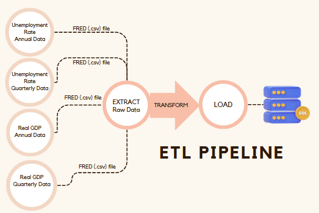

# Data Report   
**Title: Unemployment Rate and GDP Growth Correlation in the United States**  
### Main Question
1. Is there a significant relationship between the annual unemployment rate and GDP growth in the United States over time?
## 1. Data Sources  

### Description of Data Sources
The data used in this project comes from the **Federal Reserve Economic Data (FRED)** database, maintained by the Research Department at the Federal Reserve Bank of St. Louis.  

### Why These Sources?  
1. **Reliability**: The Federal Reserve Bank of St. Louis is a trusted institution, ensuring high-quality and accurate data.  
2. **Comprehensiveness**: FRED covers long-term and short-term data trends, making it ideal for this project's dual-level analysis.  
3. **Ease of Access**: Datasets are downloadable in multiple formats, including CSV, facilitating integration into data pipelines.  
  

## 2. Structure and Quality of Data  

### Data Structure  
- The data is in **tabular format** with fields such as date, unemployment rate, or GDP values.  
- Input format: CSV files with consistent structure for easy parsing.  
- Output format: Transformed and stored in SQLite for efficient querying and analysis.  

## 3. Licenses  

### License Information  
The FRED datasets are free for personal, non-commercial use. Users must:  
1. Include proper attribution to FRED.  
2. Retain copyright notices where applicable.  

### Usage Compliance  
To comply with FRED’s terms:  
- Proper attribution is provided in all visualizations and reports.  
- The datasets are used for personal research and analysis in this academic project.  

For detailed legal information, see: [FRED Terms of Use](https://fred.stlouisfed.org/legal/#full-fred-terms).  

## 4. Data Pipeline  

### Technologies Used
#### Python - SQLite - Pandas

### Pipeline Overview

#### Code Explanation
The pipeline is designed to download datasets from FRED, store them in CSV format, and convert them into SQLite databases. Since the datasets are already cleaned and require no additional preprocessing, the focus is on efficient storage and accessibility.

#### Steps in the Pipeline
1. **Dataset Initialization**:  
   A dictionary `datasets` is defined, where keys represent the dataset names (e.g., `annual_unemployment`, `quarterly_gdp`) and values are their corresponding URLs from FRED.

2. **Data Download and Storage**:  
   - The `requests` library fetches the datasets directly from FRED.
   - CSV files are saved locally in a predefined `data` folder located outside the project directory. This folder is accessed using the `os` module for path management.

3. **Conversion to SQLite**:  
   - Using **Pandas**, the downloaded CSV files are read into DataFrames.
   - Each DataFrame is written into its own SQLite database file using `df.to_sql()` for efficient querying and structured storage.
   - Two options are provided in the code:  
     - Separate SQLite files for each dataset.  
     - A single SQLite file containing all datasets as separate tables (commented out).

4. **Error Handling**:  
   - If a dataset fails to download, the pipeline prints an error message with the HTTP status code.

### Result and Limitations
#### Output Data
- **Structure**:  
  The output consists of multiple SQLite files, one for each dataset. Each SQLite file contains a single table with fields representing the dataset columns, such as date, unemployment rate, or GDP.
- **Quality**:  
  The datasets from FRED are already well-structured and free from missing values or inconsistencies. No further cleaning or preprocessing was required.

#### Data Format Choice
- **SQLite as Output Format**:  
  - **Advantages**: SQLite provides a lightweight, portable database solution, making it easier to query the data for analysis compared to raw CSV files.
  - **Efficiency**: Storing data in SQLite format reduces redundancy and allows structured querying for specific use cases (e.g., filtering by date or performing joins).

#### Potential Issues
1. **Historical Bias**:  
   - Although the data is accurate, economic changes and policies from different periods may influence trends, potentially limiting the generalizability of the findings.
2. **Future Data Updates**:  
   - As the datasets are static downloads, future updates to FRED data will require re-running the pipeline.

### Cleaning and Transformation

Since the datasets were already well-structured and free from inconsistencies, no additional preprocessing or transformations were performed. The downloaded data was directly converted into SQLite format.

#### Challenges and Solutions
- **Challenge**: Diverse output formats for downloaded data.  
  - **Solution**: Standardized CSV-to-SQLite conversion ensures uniformity in the data format.
- **Challenge**: Path management for dataset storage.  
  - **Solution**: Used the `os` module to define paths dynamically, ensuring compatibility across systems.

